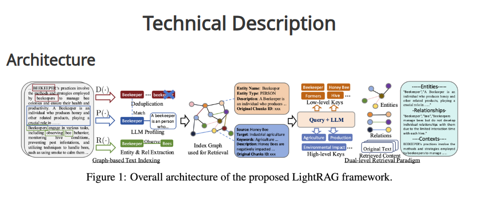

# 🧠 Tutorial: RAG com Dados Tabulares usando LightRAG

Este tutorial apresenta o conceito de RAG (*Retrieval-Augmented Generation*) aplicado a dados tabulares, mostrando como combinar consultas estruturadas (via embeddings e busca semântica) com geração de texto.

Além da explicação conceitual, vamos explorar a biblioteca LightRAG, uma implementação leve e simples para construir sistemas RAG com integração entre documentos, tabelas e LLMs.

## 🎯 Objetivos

- Entender o que é um RAG e como ele amplia a capacidade de modelos de linguagem.
- Aprender como usar LightRAG para criar consultas sobre dados tabulares.
- Integrar uma base tabular (ex: CSV de produtos, alunos, vendas, etc.) em um pipeline de recuperação e geração.
- Criar e testar perguntas em linguagem natural respondidas com base nos dados da tabela.

## 📚 Conceitos Fundamentais
### 🔹 O que é RAG?

O *Retrieval-Augmented Generation* **(RAG)** é uma técnica para aumentar o conhecimento de modelos de linguagem (LLMs), combinando duas etapas:
1. **Recuperação (Retrieval):** Busca informações relevantes em uma base de conhecimento (texto, PDFs, CSVs etc.) usando embeddings.
2. **Geração (Augmented Generation):** Passa o contexto recuperado para o modelo de linguagem (LLM), que gera uma resposta fundamentada nesses dados.

💡 Assim, o **RAG** permite que o modelo responda sobre informações externas, sem precisar ter tudo em seus pesos.

💬 *Exemplo:*

Pergunta: “Quem é o reitor da UFRPE?”
→ O **RAG** busca documentos sobre a UFRPE
→ Passa o texto encontrado ao LLM
→ O LLM gera a resposta correta com base nas fontes.

### 🔹 RAG em Dados Tabulares

Normalmente, **RAG** é aplicado a texto livre (documentos, relatórios, FAQs).
Mas com dados tabulares, podemos usar **RAG** para:
- Fazer perguntas em linguagem natural sobre planilhas (ex: “Qual o produto mais vendido?”);
- Gerar resumos automáticos dos dados (ex: “Resuma as vendas por categoria”);
- Criar assistentes analíticos que respondem com base em dados estruturados.

Para isso, convertemos as linhas ou colunas da tabela em blocos de texto, e o **RAG** atua sobre esses blocos como se fossem **“mini documentos”**.

---

### ⚙️ O que é o LightRAG

📦 [LightRAG](https://lightrag.github.io/) é uma biblioteca Python desenvolvida pela Universidade de Hong Kong (HKU), voltada para pesquisa e experimentação de arquiteturas RAG de forma leve e extensível.

Em vez de você ter que configurar manualmente embeddings, vetores e prompts, o LightRAG faz tudo isso automaticamente.

Ela pode ser instalada diretamente a partir do GitHub oficial:
```bash
pip install git+https://github.com/HKUDS/LightRAG.git
```

📄 **Repositório**: https://github.com/HKUDS/LightRAG

📚 **Documentação**: https://lightrag.github.io/

#### ✨ Principais recursos
| Função                                         | Descrição                                                                   |
|------------------------------------------------|-----------------------------------------------------------------------------|
| add_text / add_csv / add_pdf                   | Adiciona documentos (texto, CSV, PDFs) ao sistema.                          |
| query("pergunta")                              | Faz uma pergunta em linguagem natural e retorna a resposta.                 |
| Integração com modelos OpenAI, Ollama e outros | Permite escolher qual modelo de linguagem usar.                             |
| Suporte a dados tabulares                      | Transforma automaticamente planilhas em textos descritivos para embeddings. |

#### 🚀 Como o LightRAG funciona por dentro

1. **Indexação baseada em grafo** (*Graph-based Text Indexing*)
  - Ele transforma cada texto (ou linha de tabela) em chunks e extrai entidades e relações.
  - Cada entidade e relação se torna um nó e aresta no grafo.
2. **Deduplicação e Extração Semântica via LLM**
  - O LLM é usado para identificar relações de significado entre os textos e consolidar entidades equivalentes.
3. **Recuperação dual (Dual-level Retrieval)**
  - Durante a consulta, o sistema busca tanto nos vetores (embeddings) quanto nas relações do grafo, combinando os dois níveis de informação.
  - Neste tutorial, utilizamos **apenas a recuperação local baseada em embeddings**, o que é suficiente para bases tabulares pequenas e garante execução leve.
4. **Geração**
  - O contexto recuperado (nós + arestas + chunks) é enviado ao LLM, que gera a resposta fundamentada nos dados.

<div align="center">  <br> <em>Figura 1: Arquitetura geral do framework LightRAG (HKU).</em> </div>

---

## 🔧 Pré-requisitos
- Python: 3.11.5 (ou superior)
- Ollama instalado localmente (https://ollama.com/download)
- Modelos necessários:
  - `gemma2:2b`
  - `nomic-embed-text`
---

## ⚙️ Instalação e configuração

```bash
git clone https://github.com/leovianaf/light-rag-tutorial.git
cd light-rag-tutorial
```

Acessando o repositório, você deve criar seu ambiente virtual, ativá-lo e instalar as dependências:
```bash
python -m venv venv
source venv/bin/activate
pip install -r requirements.txt
```

Com o ambiente virtual configurado, você deve utilizá-lo para executar os notebooks.

---

## 💻 Exemplo Prático
O notebook de exemplificação do **Light RAG** pode ser acessado aqui: [`light_rag_example.ipynb`](notebooks/light_rag_example.ipynb)

Neste notebook, usamos **modelos locais do Ollama** (`gemma2:2b` e `nomic-embed-text`) para demonstrar o pipeline completo **sem depender de APIs externas**.
Essa abordagem torna o tutorial leve, acessível offline e ideal para fins didáticos, permitindo que cada aluno rode o experimento no próprio computador.

---

## 🧩 Exercício Proposto
### 🎯 Desafio

Cada dupla deverá:
1. Escolher uma das bases disponibilizadas em [`data`](data/).
2. Implementar um mini RAG usando **LightRAG** para responder perguntas sobre essa base.
3. Formular **três (ou mais)** perguntas diferentes em **linguagem natural** e comparar as respostas geradas.

### 🧮 Experimento Sugerido

Teste o **LightRAG** com o dataset completo e com uma versão reduzida do dataset (~300 linhas). Compare os **tempos de execução** e o **comportamento das respostas**.

Você pode fazer isso facilmente com o *pandas*:
```bash
import pandas as pd

df = pd.read_csv("imdb_top_1000.csv")  # ou high_popularity_spotify_data.csv
df_sample = df.sample(300, random_state=42)
df_sample.to_csv("dados_reduzidos.csv", index=False)
```

---

### 🧪 Exemplos

Trecho do Arquivo: [`imdb_top_1000.csv`](data/imdb_top_1000.csv)
| Series_Title             | Released_Year | Genre                | IMDB_Rating | Director             | Star1          | Star2          |
| ------------------------ | ------------- | -------------------- | ----------- | -------------------- | -------------- | -------------- |
| The Shawshank Redemption | 1994          | Drama                | 9.3         | Frank Darabont       | Tim Robbins    | Morgan Freeman |
| The Godfather            | 1972          | Crime, Drama         | 9.2         | Francis Ford Coppola | Marlon Brando  | Al Pacino      |
| The Dark Knight          | 2008          | Action, Crime, Drama | 9.0         | Christopher Nolan    | Christian Bale | Heath Ledger   |

Possíveis Perguntas:
- “Qual diretor tem mais filmes nesta lista?”
- “Qual é o filme com maior avaliação?”
- “Qual o tempo médio dos filmes de ação?”

---

Trecho do Arquivo: [`high_popularity_spotify_data.csv`](data/high_popularity_spotify_data.csv)
| track_name         | track_artist          | playlist_genre | danceability | energy | loudness | valence | tempo   | track_popularity | track_album_release_date |
| ------------------ | --------------------- | -------------- | ------------ | ------ | -------- | ------- | ------- | ---------------- | ------------------------ |
| Die With A Smile   | Lady Gaga, Bruno Mars | pop            | 0.521        | 0.592  | -7.777   | 0.535   | 157.969 | 100              | 2024-08-16               |
| BIRDS OF A FEATHER | Billie Eilish         | pop            | 0.747        | 0.507  | -10.171  | 0.438   | 104.978 | 97               | 2024-05-17               |
| That’s So True     | Gracie Abrams         | pop            | 0.554        | 0.808  | -4.169   | 0.372   | 108.548 | 93               | 2024-10-18               |

Possíveis Perguntas:
- “Qual artista tem a música mais popular da lista?”
- “Qual faixa tem maior energia e qual tem maior valência?”
- “Qual a média de danceability das músicas pop lançadas em 2024?”
- “Qual é a música mais longa do dataset?”

---

### 📤 Entrega

Um aluno da dupla deve subir:
- O arquivo .ipynb com o código do mini RAG;
- Um print das perguntas e respostas obtidas;
- Uma breve resposta para a reflexão:
  "*Quando o RAG errou, por que isso aconteceu?*"

---

## 📜 Licença

Este projeto está licenciado sob os termos da **MIT License**.
Você é livre para usar, modificar e distribuir este código, desde que mantenha o aviso de copyright.
